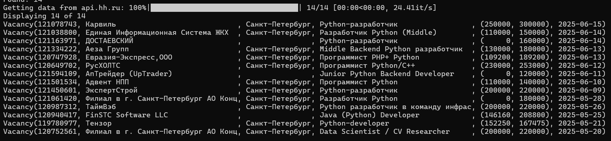
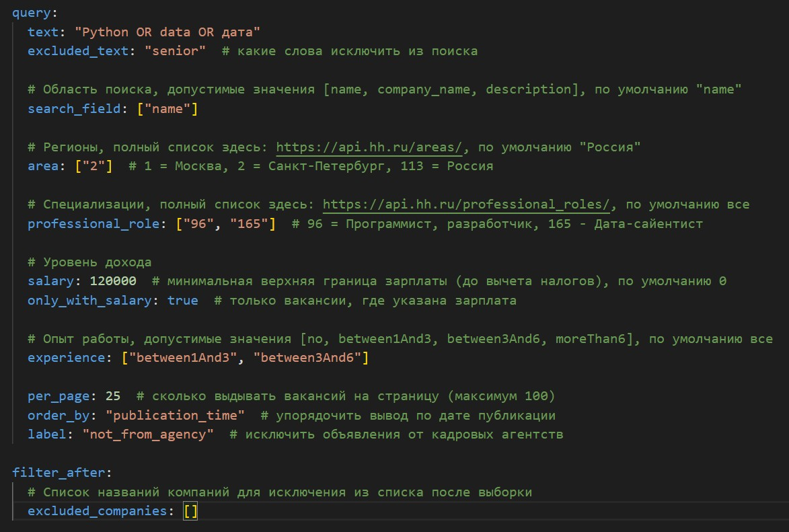
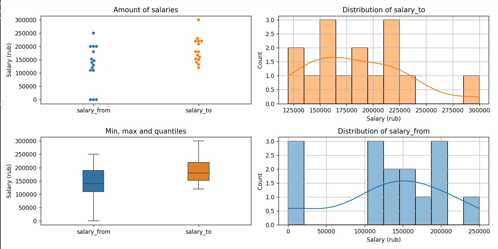

# Автоматизация поиска и анализа вакансий с сайта Хэдхантер

Программа *HH Inspector* упрощает поиск, сбор и анализ вакансий с сайта Хэдхантер (hh.ru), используя их собственный API.
Реализует следующие функции:
* Поиск вакансий по различным параметрам (задаются в файле `config.yaml`).
* Сохранение данных по вакансиям в форматах JSON, CSV.
* Выдача различной статистики (по зарплатам, ключевым словам) на экран.
* Рисование графиков по распределению зарплат.

## Пример результатов поиска



## Установка и запуск

Для работы программа нужен Python 3.13. Для управления зависимостями используется [uv](https://docs.astral.sh/uv/), которая также должна быть установлена.

Клонировать репозиторий:
```
git clone https://github.com/peternest/hh-inspect.git
cd hh_inspect
```

Создать виртуальное окружение и установить зависимости:
```
uv sync
```

Запустить программу с параметрами по умолчанию:
```
uv run src/hh_inspect
```

Данные по найденным вакансиям сохраняются в папке `output` (файлы `vacancies.csv` и `vacancies.json`).

## Основные настройки

Параметры поиска вакансий задаются в файле `config.yaml` в секции `query`. Подробные комментарии описывают допустимые значения для каждого поля и значения по умолчанию.



Общие параметры задаются в секции `general` и определяют, какие выходные данные будут созданы в результате работы.


## Пример вывода графиков по зарплатам



## Документация по API Хэдхантер

[Документация на сайте hh.ru с примерами запросов](https://api.hh.ru/openapi/redoc)

[Github репозиторий hh.ru с документацией](https://github.com/hhru/api)
